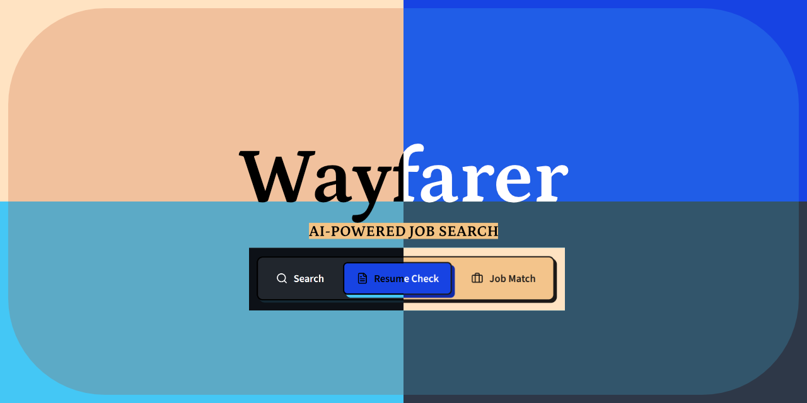

# Wayfarer

> AI-Powered Job Search Automation Platform — locally-hosted, RAG-driven, with owned retrieval, scoring, and matching logic.

---

## What Wayfarer Does

| Stage | What it answers | Endpoint |
|---|---|---|
| **Web Search Agent** | "Search the web for X and synthesize an answer with sources." | `POST /api/v1/search` |
| **ATS Resume Checker** | "Check my resume against this JD, tell me exactly what to change and why." | `POST /api/v1/resume/check` |
| **Job Matcher** | "Show me live postings ranked by fit, with apply links." | `GET /api/v1/jobs/match` |

Every output is **human-in-the-loop**: the system evaluates, ranks, and drafts — it never submits, auto-fills, or clicks anything on a third-party site on your behalf.

### Differentiators

- **Owned RAG pipeline** — embeddings, vector store, hybrid scoring are all in-process. No prompt orchestration over markdown.
- **Honest substitution** — every keyword suggestion in Stage 2 is traceable to a real resume bullet. Gaps stay gaps, never auto-inserted.
- **Confidence-tiered redlines** — `Verified` / `Reworded` / `Gap`, the third genuinely surfaced, not hidden.
- **Multi-provider inference** — rate-limit-aware router with NVIDIA NIM → OpenRouter → Ollama fallback. Free tiers only.
- **Config-driven job boards** — adding a board = a YAML entry, not a code change.
- **Primary resume** — upload once in Settings, used across all stages automatically.

---

## Architecture

```
                    ┌─────────────────────────────┐
                    │        LLM Router            │
                    │  NVIDIA NIM ⇄ OpenRouter      │
                    │  rate-limit-aware fallback    │
                    └───────────────┬───────────────┘
                                    │
        ┌───────────────────────────┼───────────────────────────┐
        │                           │                           │
┌───────▼────────┐      ┌───────────▼──────────┐     ┌───────────▼──────────┐
│   Stage 1       │      │       Stage 2         │     │       Stage 3         │
│  Search Agent   │      │  Resume/ATS Checker    │     │   Job Matcher         │
│                 │      │                        │     │                       │
│ Search API      │      │ AnyDoc (14 formats)    │     │ 12 job sources        │
│ (Tavily/Brave)  │      │ + OCR fallback         │     │ Hybrid scoring        │
│ + Crawl4AI      │      │ Embedding matcher      │     │ Graph-filtered match  │
│ fetch/clean     │      │ Confidence-tiered      │     │ Location/age/score    │
│                 │      │ redline generator      │     │ filters + legitimacy  │
└─────────────────┘      └────────────────────────┘     └───────────────────────┘
        │                           │                           │
        └───────────────────────────┴───────────────────────────┘
                                    │
                        ┌───────────▼───────────┐
                        │       ChromaDB          │
                        │  search_cache           │
                        │  resume_sections        │
                        │  job_postings           │
                        └─────────────────────────┘
```

### Shared Infrastructure

- **LLM Router** — Multi-provider inference with automatic fallback (NVIDIA NIM → OpenRouter → Ollama → LM Studio). Rate-limit-aware, prompt-caching enabled.
- **Embedding Layer** — `nomic-embed-text` via Ollama, same config across all stages.
- **ChromaDB** — Single persistent store, three collections (`search_cache`, `resume_sections`, `job_postings`).
- **Confidence Scoring** — `Verified / Reworded / Gap` classifier shared between Stage 2 and Stage 3.
- **Resume Graph** — Graph-based structured resume memory for token-efficient per-posting matching.

---

## Quick Start

### One-Command Setup

```bash
git clone https://github.com/anubhavsanket/wayfarer.git
cd wayfarer
bash setup.sh
```

Or manually:

```bash
git clone https://github.com/anubhavsanket/wayfarer.git
cd wayfarer
cp .env.example .env
docker compose up --build
```

### First-Time Setup

1. **Pull models** (first time only):
```bash
docker compose exec ollama ollama pull qwen2.5:1.5b
docker compose exec ollama ollama pull qwen3:1.7b
docker compose exec ollama ollama pull nomic-embed-text
```

2. **Open the app**: http://localhost:3000

3. **Go to Settings** → upload your resume in the **Primary Resume** card.

4. **Start using**:
   - **Resume Check** → paste a JD → check against your primary resume
   - **Job Match** → click Find Matches → use Filters to narrow results
   - **Search** → general web search with citations

### Local Development (No Docker)

```bash
# Backend
cd backend
python -m venv .venv
source .venv/Scripts/activate   # Windows: .venv\Scripts\activate
pip install -r requirements.txt
uvicorn backend.app.main:app --reload --host 0.0.0.0 --port 8000

# Frontend (separate terminal)
cd frontend
npm install
npm run dev
```

---

## Configuration

Configuration is layered:

1. **`.env`** — runtime overrides (API keys, hostnames). Highest priority.
2. **Settings tab** in the frontend — stores keys in localStorage, sent as request headers.
3. **`config/job_boards.yaml`** — Stage 3 board registry (add a board = config change).

### Supported LLM Providers

| Provider | `.env` setting | API key needed? | Notes |
|---|---|---|---|
| NVIDIA NIM | `LLM_PROVIDER=nvidia` | `NVIDIA_NIM_API_KEY` | Free tier, fast |
| OpenRouter | `LLM_PROVIDER=openrouter` | `OPENROUTER_API_KEY` | Free tier, wide model selection |
| Ollama | `LLM_PROVIDER=ollama` | No | Local, pull models first |
| LM Studio | `LLM_PROVIDER=lmstudio` | No | Set `LMSTUDIO_ENDPOINT` + `LMSTUDIO_MODEL` |
| Custom | `LLM_PROVIDER=custom` | `CUSTOM_LLM_API_KEY` | Any OpenAI-compatible endpoint |

### Model Selection

Two models are used for different task types, benchmarked across 21 rewrite cases and 20 classification cases:

| Tier | Model | Use cases | Why |
|---|---|---|---|
| **Simple** | qwen2.5:1.5b | Keyword extraction, classification | Fast (1.4s), token-efficient (30 tok), non-thinking |
| **Complex** | qwen3:1.7b | Bullet rewriting, synthesis | High quality (97% accuracy), thinking model |

Total VRAM: 2.76GB (1.2GB headroom on 4GB GTX 1650).

### User Preferences

| Setting | `.env` key | Default | Description |
|---|---|---|---|
| Visa sponsorship | `NEEDS_VISA_SPONSORSHIP` | `false` | Flag no-sponsorship postings as blockers |
| Prompt caching | `ENABLE_PROMPT_CACHING` | `true` | Enable prompt caching for repeated calls |
| Model override | `OLLAMA_MODEL` | `qwen2.5:1.5b` | Override the default Ollama model |

---

## API Reference

### `GET /health`
```json
{"status":"ok","dependencies":[{"name":"chromadb","status":"up"},...]}
```

### `POST /api/v1/search` — Stage 1
```bash
curl -X POST http://localhost:8000/api/v1/search \
  -H 'Content-Type: application/json' \
  -d '{"query": "best practices for RAG?", "max_sources": 3}'
```

### `POST /api/v1/resume/check` — Stage 2
```bash
# Check primary resume (no file upload needed)
curl -X POST http://localhost:8000/api/v1/resume/check \
  -F "jd_text=Looking for an ML engineer with Python, PyTorch, and AWS."

# Check a specific resume file
curl -X POST http://localhost:8000/api/v1/resume/check \
  -F "resume_file=@my_resume.pdf" \
  -F "jd_text=Looking for an ML engineer with Python, PyTorch, and AWS."
```

### `POST /api/v1/resume/save` — Stage 2
Three modes: `new_file` (default), `overwrite` (requires `confirm_overwrite: true`), `set_as_primary`.

### `POST /api/v1/resume/primary` — Primary Resume
```bash
# Upload and set as primary
curl -X POST http://localhost:8000/api/v1/resume/primary \
  -F "resume_file=@my_resume.pdf"

# Get current primary
curl http://localhost:8000/api/v1/resume/primary
```

### `GET /api/v1/jobs/match` — Stage 3
| Param | Type | Default | Notes |
|---|---|---|---|
| `resume_id` | string | optional | Omit to use primary resume |
| `limit` | int | 20 | Max results |
| `location_mode` | enum | `specific_city` | `specific_city` / `remote_only` / `hybrid` / `open_to_relocation` |
| `cities` | csv | `""` | Comma-separated cities |
| `remote_ok` | bool | false | Include remote postings |
| `fresher_only` | bool | false | Filter to fresher/junior roles |
| `max_age_days` | int | 30 | Max age of postings in days |
| `min_score` | float | 0.0 | Minimum match score (0-1) |
| `sources` | csv | `""` | Comma-separated source names |
| `test` | bool | false | Return sample data |

### `POST /api/v1/jobs/refresh` — Stage 3 Background
```bash
curl -X POST http://localhost:8000/api/v1/jobs/refresh
```
Re-fetches from all enabled boards, deduplicates, normalizes, and stores in ChromaDB.

### `GET/POST /api/v1/config/model` — Model Configuration
```bash
curl http://localhost:8000/api/v1/config/model
curl -X POST http://localhost:8000/api/v1/config/model \
  -H "Content-Type: application/json" \
  -d '{"ollama_model": "qwen3:1.7b"}'
```

---

## Job Board Registry

Every job source is defined in **`config/job_boards.yaml`**. Adding a new board is a config change, not a code change.

### Active Sources (with descriptions)

| Source | Auth | Coverage |
|---|---|---|
| RemoteOK | None | Remote tech |
| Remotive | None | Remote tech/design |
| Jobicy | None | Remote jobs |
| Arbeitnow | None | Global |
| Himalayas | None | Remote jobs |

### Title-Only Sources

| Source | Auth | Coverage |
|---|---|---|
| Bluedoor | API key | US-focused |
| LinkedIn Guest | None | Global |

### Configurable Sources (target-list based)

| Source | Auth | How to enable |
|---|---|---|
| Adzuna | API key | Set `ADZUNA_API_KEY` in `.env`, set `enabled: true` |
| Greenhouse | Board tokens | Set `GREENHOUSE_BOARD_TOKENS` in `.env`, set `enabled: true` |
| Lever | Company slugs | Set `LEVER_POSTING_URLS` in `.env`, set `enabled: true` |
| Workday | Company paths | Set `WORKDAY_URLS` in `.env`, set `enabled: true` |
| Ashby | Org slug | Set `ASHBY_ORG` in `.env`, set `enabled: true` (experimental) |

---

## Token & Cost Optimization

### Structured Resume Memory (Graph-Based)
Resume is parsed once into an entity graph (skills, roles, projects, metrics). Per-posting matching pulls only the relevant subgraph instead of re-sending the full resume text.

### Embedding-First Filtering
Three-stage filter: (1) dedup + stale-drop (zero-token), (2) embedding similarity on top-50, (3) LLM keyword overlap on top-15 only.

### Prompt Caching
Enabled by default (`ENABLE_PROMPT_CACHING=true`). Passes cache-control headers to supported providers.

### Response Memoization
Resume check results cached by `hash(resume_bytes + jd_text)` with 72h TTL. Re-running the same check is instant.

### Model Right-Sizing
Different models for different tasks: qwen2.5:1.5b for classification (fast, token-efficient), qwen3:1.7b for generation (high quality). Evaluated with 21 rewrite cases and 20 classification cases.

### JD Boilerplate Stripping
EEO statements, benefits, about-us sections stripped before keyword extraction and embedding.

---

## Testing

```bash
# Unit tests
cd backend
python -m pytest tests/test_stage2.py tests/test_stage3.py -v

# E2E tests (requires Docker services running)
python -m pytest tests/test_docker_e2e.py -v

# Model evaluation
python eval_rewrite.py    # Generation benchmark (21 cases)
python eval_classify.py   # Classification benchmark (20 cases)
python eval_stability.py  # Determinism check
```

**Test status: 46 unit tests passing** (9 Stage 1 + 18 Stage 2 + 19 Stage 3).

---

## Deployment

### Docker Compose

```bash
docker compose up --build
```

| Service | Port | Purpose |
|---|---|---|
| `api` | 8000 | FastAPI backend |
| `chromadb` | 8001 | Vector store |
| `ollama` | 11434 | Local inference + embeddings |
| `redis` | 6379 | Background job queue |
| `frontend` | 3000 | React UI served by nginx |

### GPU Support

The `ollama` service includes optional NVIDIA GPU passthrough. On machines without a GPU, remove the `deploy` block from `docker-compose.yml` — the LLM router falls back to API inference automatically.

---

## Differentiators

| Dimension | Wayfarer | `ai-job-search` (28.6k★) | `career-ops` (61.9k★) |
|---|---|---|---|
| Core engine | Owned RAG pipeline — embeddings, vector store, hybrid scoring | Claude Code slash commands + prompt orchestration | Any AI coding CLI + markdown state |
| Deployment | Docker Compose, one command | CLI, requires Claude Code + LaTeX | CLI, requires AI coding CLI |
| Resume handling | Redlines existing resume with tracked suggestions | Generates fresh CV per job (LaTeX) | Generates fresh ATS-optimized PDF |
| Market | India-first (Bengaluru, Naukri/LinkedIn India) | Denmark-first | Global, AI/tech-first |
| Inference | Multi-provider router with rate-limit fallback | Assumes paid Claude subscription | CLI-agnostic |
| Transparency | Confidence-tiered: Verified / Reworded / Gap | Keyword-honesty rule (binary) | 6-block evaluation + human-in-the-loop |
| ATS check | Structural diff + embedding similarity | PDF text layer + keyword coverage | Keyword-injected PDF generation |
| Posting trust | Ghost/scam detection + sponsorship blocker | Not addressed | Ghost-job detection + sponsorship blocker |

---

## Key Files

```
backend/
  app/
    main.py              — FastAPI routes (all endpoints)
    config.py            — Settings (model tiers, benchmarks documented)
    llm_router.py        — Multi-provider LLM with fallback + prompt caching
    vector_store.py      — ChromaDB client
    core/
      confidence.py      — Verified/Reworded/Gap classifier (shared Stage 2/3)
      resume_graph.py    — Graph-based resume memory for token-efficient matching
    models/
      schemas.py         — Pydantic models (all API contracts)
      job_boards.py      — Config-driven job board connector
    services/
      resume_parser.py   — AnyDoc + fallback parsers + OCR
      ats_checker.py     — ATS scoring + keyword extraction
      resume_saver.py    — Save modes (new/overwrite/set_as_primary)
      resume_store.py    — File storage + primary resume index
      job_matcher.py     — Hybrid scoring + filters + liveness checks
      legitimacy.py      — Ghost/scam detection + boilerplate stripping
      search_service.py  — Query decomposition + synthesis
      search_api.py      — Tavily/Brave search clients
      web_fetch.py       — Crawl4AI page fetcher
  tests/                 — 46 unit tests
  eval_rewrite.py        — Generation benchmark (21 cases, 4 models)
  eval_classify.py       — Classification benchmark (20 cases, 5 models)
  eval_stability.py      — Determinism check

frontend/
  src/
    pages/
      Search.tsx          — Web search with citations
      ResumeCheck.tsx     — ATS check + redline view + save
      JobMatch.tsx        — Job matching with filters
      Settings.tsx        — API keys + primary resume + model config
    stores/settings.ts    — localStorage settings + auth headers
    lib/api.ts            — API client

config/
  job_boards.yaml         — 12 job sources (config-driven)
  settings.yaml           — Reference config (informational)
```

---

## License

Proprietary — built for personal job search automation and as an AI engineering portfolio piece.
